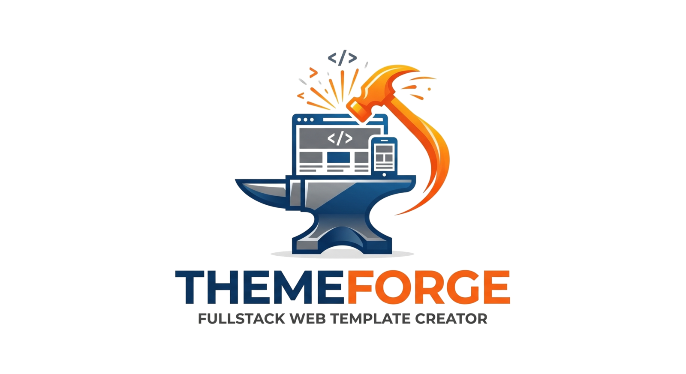

<p align="center">
    
</p>

<p align="center">
  <strong>Forge production-ready web templates with AI agents.</strong>
</p>

<p align="center">
  <a href="https://github.com/pcreativedev/pcreative-studio/actions/workflows/build-linux.yml"></a>
  <a href="https://github.com/pcreativedev/pcreative-studio/actions/workflows/build-macos.yml"></a>
  <a href="https://github.com/pcreativedev/pcreative-studio/releases/latest"></a>
  <a href="https://github.com/pcreativedev/pcreative-studio/releases"></a>
  <a href="https://github.com/pcreativedev/pcreative-studio/stargazers"></a>
</p>

<p align="center">
  <a href="LICENSE"></a>
  <a href="https://www.python.org/"></a>
  
  
  
</p>

<p align="center">
  <a href="docs/USER_GUIDE.md">User guide</a> ·
  <a href="ROADMAP.md">Roadmap</a> ·
  <a href="CHANGELOG.md">Changelog</a> ·
  <a href="../../releases">Releases</a> ·
  <a href="CONTRIBUTING.md">Contributing</a> ·
  <a href="docs/WORDPRESS.md">WordPress guide</a> ·
  <a href="docs/SHOPIFY.md">Shopify guide</a> ·
  <a href="docs/ECOMMERCE.md">E-commerce guide</a> ·
  <a href="NOTICE.md">Third-party</a> ·
  <a href="TRADEMARKS.md">Trademarks</a>
</p>

---

**Pcreative Studio** is a PyQt6 desktop GUI that scaffolds modern template
projects for **ThemeForest / CodeCanyon / Creative Market / Gumroad**
and drives them end-to-end with **AI coding agents** (Claude Code,
Codex, Gemini, OpenCode).

Pick a stack, pick a mode (from scratch / recreate-from-reference /
adopt-local / existing-repo), pick an AI provider, and Pcreative Studio:

- 🏗️ **Runs the official scaffold** of the stack (Next.js / Astro /
  Laravel / WordPress / Flutter / Tauri / + ~55 more).
- 🧠 **Drops a `CLAUDE.md`** (or `AGENTS.md`) with project context,
  market research, requirements and anti-copy rules.
- 💬 **Analyses a reference template interactively** with the AI
  (multi-turn dialog) and injects the conversation into the project.
- 🖼️ **Opens a per-project window** with embedded multi-tab preview,
  embedded terminal (xterm.js + node-pty), one-click GitHub push,
  and optional pixel-art session visualizer.
- 💰 **Tracks AI cost** with QtCharts donut / bar / stacked charts
  pulling from your local Claude Code + Codex session stores.
- 🤝 **Compares agents side-by-side** — same prompt, multiple models
  in parallel.
- 🚀 **Deploys demos** to Netlify / Vercel / Cloudflare Pages / Surge
  with one click.
- 🔐 **Wires your own licensing system** into every generated theme
  (Lemon Squeezy / Polar / Paddle / custom endpoint).
- 🎨 **Theme system for the app itself** — 8 builtin themes (Dark /
  Light / Dracula / Nord / Tokyo Night / Brutalism / Linear / Soft UI),
  visual editor with live preview, **Figma DTCG import** (works with
  free-plan Tokens Studio plugin + Enterprise REST API), Lucide
  iconography that re-tints with the active accent color. See
  [`docs/USER_GUIDE.md` §17](docs/USER_GUIDE.md#17-app-themes).
- ✨ **Vibe scaffolder** — describe what you want in natural language
  (*"Landing premium para clínica dental en Madrid, paleta cálida"*)
  and Pcreative Studio calls the active AI provider to pre-fill stack +
  type + theme + a polished 200-word dev prompt for the agent. See
  [`docs/USER_GUIDE.md` §18](docs/USER_GUIDE.md#18-vibe-scaffolder).
- 📡 **MCP server + curated catalog** — Pcreative Studio ships its own
  stdio MCP server (8 tools: list_stacks / estimate_cost /
  run_preflight / build_zip / suggest_stack / …) so Claude Code,
  Cursor, Windsurf, OpenCode can drive Pcreative Studio from their own
  conversation window. Plus a curated catalog of 12 community MCPs
  (Playwright, Chrome DevTools, GitHub, Figma, Postgres, Shopify
  Dev, browsermcp…) auto-configured per scaffolded project via
  `.mcp.json` — and the suggestions are now **stack-aware**: JS UI
  MCPs (Magic / Magic UI / shadcn, framer-motion / 21st.dev) are only
  proposed on Node/React frontends (including monorepos), never on
  non-JS stacks. See [`docs/USER_GUIDE.md` §19](docs/USER_GUIDE.md#19-mcp-servers).

📖 **[Read the full user guide → `docs/USER_GUIDE.md`](docs/USER_GUIDE.md)**

## Download

Pre-built packages for each tagged release are published on the
[Releases page](../../releases). Pick the one matching your OS:

| Format | Platform | Install |
|---|---|---|
| `Pcreative Studio-<ver>-x86_64.AppImage` | 🐧 Any Linux x86_64 | `chmod +x *.AppImage && ./Pcreative Studio-*.AppImage` |
| `pcreative_studio_<ver>_amd64.deb` | 🐧 Debian / Ubuntu | `sudo apt install ./pcreative_studio_*.deb` |
| `pcreative-studio-<ver>-1.x86_64.rpm` | 🐧 Fedora / RHEL / openSUSE | `sudo dnf install ./pcreative-studio-*.rpm` |
| AUR `pcreative-studio` / `pcreative-studio-git` | 🐧 Arch / CachyOS / Manjaro | `paru -S pcreative-studio` (after AUR publish) |
| `Pcreative Studio-macOS.zip` (alpha) | 🍎 macOS 13+ x86_64 | Unzip, drag to `/Applications/`, right-click → Open |
| `Source code (tar.gz / zip)` | 🐧🍎🪟 Any | Auto-generated by GitHub for every release |

Linux packages are built on `ubuntu-22.04` (glibc 2.35) so the
AppImage runs on most distros from 2022 onwards.

## Platform support

| Platform | Status | Notes |
|---|---|---|
| 🐧 **Linux** | ✅ **Stable** | Primary development platform. Tested on CachyOS / Arch / Ubuntu / Fedora. Pre-built AppImage / .deb / .rpm on the [Releases](../../releases) page (latest tag shown by the badge above), or run from source with `python3 pcreative_studio.py`. |
| 🍎 **macOS** | ⚠️ **Alpha** | Cross-platform refactor complete (subprocess, file manager, terminal, paths all dispatched per OS). Pre-built `.app` from the [Releases](../../releases) page (built on `macos-latest`). **Not yet validated on real Macs** — expect rough edges. Not code-signed → first launch needs `Cmd+click → Open` (Gatekeeper). |
| 🪟 **Windows** | ⚠️ **Alpha** | Real `.exe` installer (Program Files, Add/Remove programs, Start-menu shortcuts). Bundles Node.js + git so the heavy runtimes need no download; software-OpenGL fallback for GPU-less environments; embedded terminal via prebuilt node-pty + Git Bash. **Validated end-to-end on a Windows 10 VM** (create project → scaffold → preview → terminal → AI agent); not yet on a wide range of real hardware. Not code-signed → SmartScreen warning on first run ("More info → Run anyway"). |

### What "alpha" means here

**Linux is the stable, daily-driver platform** — it's where Pcreative Studio is
developed and tested. macOS and Windows are **alpha**: the cross-platform
work is done and the apps build + run, but they haven't gone through the
same real-world mileage as Linux.

Concretely, for macOS / Windows:

- **The builds come straight from CI** (GitHub Actions on `macos-latest` /
  `windows-latest`) on every release tag — they're real, installable
  artifacts, not mock-ups.
- **Windows** has been validated end-to-end on a Windows 10 VM (install →
  create project → scaffold a Next.js theme → live preview → embedded
  terminal → AI agent reading the project context). Still untested across
  many GPU/driver/edition combos, so edge cases are expected.
- **macOS** hasn't been run on real Apple hardware yet — the `.app` builds
  in CI but needs beta testers to shake out issues.
- **Neither is code-signed yet.** On first launch you'll hit Gatekeeper
  (macOS: `Cmd+click → Open`) or SmartScreen (Windows: `More info → Run
  anyway`). Code-signing is tracked in [`ROADMAP.md`](ROADMAP.md).
- **Some stacks need extra runtimes** (PHP, Java, Rust, Go, Bun, Deno,
  Ruby, Hugo…). The built-in dependency wizard installs them via
  winget / brew, or the per-stack scaffold tells you what's missing.

If you run it on macOS or Windows, **please report what works and what
doesn't** — that feedback is exactly what moves these from alpha to stable.

## Quick install

### Linux (from source)

```bash
git clone https://github.com/pcreativedev/pcreative-studio.git
cd pcreative-studio

# System deps (Arch / CachyOS)
sudo pacman -S --needed python python-pyqt6 python-pyqt6-webengine python-pyqt6-charts nodejs npm git

# Embedded terminal server
cd terminal && npm install && cd ..

# Launch
./launch.sh
```

For Debian / Ubuntu instructions, AI provider setup, and full
configuration, see the [user guide](docs/USER_GUIDE.md#3-installation).

### macOS (pre-built .app — alpha)

1. Download `Pcreative Studio-macOS.zip` from the [Releases](../../releases) page.
2. Unzip → drag `Pcreative Studio.app` to `/Applications/`.
3. First launch: **right-click** → **Open** → confirm the "developer not
   identified" dialog. Subsequent launches will work normally.
4. Install Node + the AI CLIs separately (the .app doesn't bundle them):
   ```bash
   brew install node gh
   npm i -g @anthropic-ai/claude-code @openai/codex @google/gemini-cli opencode-ai
   ```

### macOS (from source)

```bash
git clone https://github.com/pcreativedev/pcreative-studio.git
cd pcreative-studio
brew install python@3.12 node gh
pip3 install pyqt6 pyqt6-webengine pyqt6-charts
cd terminal && npm install && cd ..
python3 pcreative_studio.py
```

### Windows (pre-built installer — alpha)

1. Download `Pcreative Studio-Setup-X.Y.Z.exe` from the [Releases](../../releases) page.
2. Run the installer. It installs per-user to
   `%LOCALAPPDATA%\Programs\Pcreative Studio\` — no admin required.
3. First launch will trigger a SmartScreen warning ("Unknown
   publisher"). Click **More info** → **Run anyway**. The
   installer is not yet code-signed.
4. Install Node + AI CLIs separately (the installer doesn't
   bundle them). The official way for each:
   ```powershell
   # Install Node.js from https://nodejs.org/ or via winget:
   winget install OpenJS.NodeJS.LTS
   winget install GitHub.cli
   winget install Anthropic.ClaudeCode
   # Other AI CLIs via npm:
   npm i -g @openai/codex @google/gemini-cli opencode-ai
   ```

### Windows (from source)

```powershell
git clone https://github.com/pcreativedev/pcreative-studio.git
cd pcreative-studio
winget install Python.Python.3.12 OpenJS.NodeJS.LTS GitHub.cli
pip install pyqt6 pyqt6-webengine pyqt6-charts
cd terminal; npm install; cd ..
python pcreative_studio.py
```

## Highlights

- **Web UI (Neo-Tokyo · Matrix · Kawaii)** — Pcreative Studio ships a full
  web interface (rendered in QtWebEngine) with three switchable themes,
  each with its own boot splash. Every screen is wired to the same real
  backend as the classic UI. Switch in Settings → Themes; set
  `PCREATIVE STUDIO_CLASSIC=1` for the native QWidget UI. See [Web UI](#web-ui).
- **60+ stacks** — Next.js, Astro, Laravel, WordPress (5 builder packs
  with MCP-adapter), **e-commerce stacks** (7 Shopify variants +
  Magento/Hyvä, Saleor, Vendure, BigCommerce, PrestaShop, OpenCart,
  Sylius + **ForgeCommerce** self-hosted on Medusa 2 + Next.js —
  see [docs/ECOMMERCE.md](docs/ECOMMERCE.md) &
  [docs/SHOPIFY.md](docs/SHOPIFY.md)), Flutter, Expo, Ionic,
  Tauri, Electron, Spring Boot, Ktor, Phaser, R3F, and more.
- **🛒 ForgeCommerce stack** — headless, self-hosted e-commerce on
  **Medusa 2 + Next.js**: multi-gateway payments, semantic search with
  pgvector, and a non-interactive Docker scaffold (Postgres + Redis).
  Includes a `forge-commerce-growshop` variant for specialised catalogs
  with age-gating / legal-notice handling. See
  [docs/ECOMMERCE.md](docs/ECOMMERCE.md).
- **📱 Use the engine from your phone** — `api_gateway.py` exposes the
  Pcreative Studio backend over **FastAPI** (JSON-RPC + WebSocket streaming +
  file upload, bearer-token auth via env or `~/.config/pcreative-studio`,
  meant to sit behind a VPN / private network). A PWA + Capacitor
  wrapper (`webui/mobile/`, `mobile/`) installs it as an app, and
  `webui/remote/tfbridge-remote.js` re-implements `window.tfBridge`
  over the API so the web UI runs unchanged on mobile. Push
  notifications via FCM (`push_service.py`).
- **Multi-stack mono-repo detection** — automatic sub-project
  dropdown for projects like `Files/Laravel/` + `Files/Flutter/`.
- **Conversational reference analysis** — multi-turn IA dialog with
  TTFT/token/cost metrics, saved into the project's CLAUDE.md.
- **Embedded preview with tabs** — multiple URLs in the same window,
  shared URL bar, screenshot to PNG, DevTools.
- **GitHub integration** — auto-detects existing repos in your account
  and your org, offers update-or-create with idempotent `.gitignore`
  sanitisation before push.
- **🔬 Pre-flight checker** — 13 automated checks against ThemeForest
  requirements (README, LICENSE, jQuery legacy, hardcoded tracking,
  placeholders unresolved, project size, etc.) before you upload.
- **📦 Marketplace ZIP builder** — one click produces a `<slug>.zip`
  with aggressive exclusions (node_modules, .git, .env, .claude,
  MEMORY.md…) ready for ThemeForest / Gumroad / Creative Market.
- **Gallery** with card view + custom tags + project archive + last
  AI session indicator + command palette (Ctrl+K).
- **Pixel Office visualizer** (optional) — your active Claude Code
  sessions as pixel-art avatars in a virtual office.

## Web UI

Since **v1.6.0** Pcreative Studio ships a full **web interface** rendered inside
QtWebEngine and wired to the Python backend through a `QWebChannel` bridge.
It is the default UI; nothing is mocked — every screen drives the same real
scaffolder, preview, cost tracker, licensing and Operator as the classic UI.

- **Three themes**, each with its own boot splash, switchable in
  **Settings → Themes**:
  - **Neo-Tokyo** — cyberpunk cyan/magenta (default).
  - **Matrix** — phosphor-green terminal.
  - **Kawaii** — pastel/rounded.
  Web themes recolor the UI live; classic (QWidget) themes restart the app.
- **Plug-and-play web theme packs** — drop a JSON in `webui/themes/<slug>.json`
  for a live recolor; `tools/import_web_theme.py` converts a Claude Design CSS
  export into a pack.
- **Screens** (all real): Gallery (favorites/tags/archive/delete), New project
  (4 modes + reference analysis + extras), Project window (opens in its own
  window; setup runs in a real PTY terminal then auto-switches to the agent;
  terminal tabs Setup/Agent/Shell/Hermes/Office; preview with port-polling +
  real-URL follow + viewport + screenshot + sub-projects; live `.mcp.json`
  editor), Cost, Compare, Market, Licensing, Settings (system status + native
  credential/dependency/onboarding/theme-editor/Figma dialogs), Operator/Hermes
  (power · mission phases · Chat · Admin dashboard), and a Command Palette
  (⌘/Ctrl+K).
- **Toggle**: `PCREATIVE STUDIO_CLASSIC=1 pcreative-studio` forces the native QWidget UI;
  `PCREATIVE STUDIO_WEB=1` forces the web UI. The choice persists in
  `~/.config/pcreative-studio/app_prefs.json` (`ui_mode`).

## License

GPL v3 — see [`LICENSE`](LICENSE) (forced by the PyQt6 dependency).

### WordPress integration packs & third-party trademarks

The WordPress stacks (`wordpress-block`, `wordpress-bricks`,
`wordpress-elementor`, `wordpress-divi`, `wordpress-breakdance`)
auto-install **free** plugins and themes from their official sources
(WordPress.org and the official Novamira GitHub releases). Premium
products (Bricks, Elementor Pro, Divi, Breakdance Pro, JetEngine,
Novamira Pro, ACF Pro, Motion.page, …) are referenced by name only —
**Pcreative Studio never bundles or redistributes their code.** To install
them automatically, supply a path to a copy you have legitimately
licensed in `~/.config/pcreative-studio/wp_packs.json` (gitignored,
local-only).

See [`NOTICE.md`](NOTICE.md) for the full attribution table and
[`TRADEMARKS.md`](TRADEMARKS.md) for the trademark notice (all
third-party names are used under nominative fair use; no affiliation
or endorsement is implied).

## Credits

### ⭐ Special thanks to [midudev](https://github.com/midudev)

Pcreative Studio wires every new project to **[autoskills](https://github.com/midudev/autoskills)**
by **[Miguel Ángel Durán (midudev)](https://github.com/midudev)** —
the tool that bridges the gap between *"a fresh empty repo"* and
*"an AI agent that actually knows what it's doing"*. Autoskills
delivers curated Anthropic / Vercel / WordPress / Shopify skill
packs straight into the agent's context on day one, so the model
doesn't have to rediscover modern frontend best practices on every
project.

Without midudev's work this project would be **half the tool it is**
— scaffolding without context is just a glorified `npm create`.
**Gracias, midu.** 🙌

[`autoskills`](https://github.com/midudev/autoskills) is licensed
CC BY-NC 4.0 — we never bundle it; Pcreative Studio invokes it via
`npx --yes autoskills` so each user pulls the latest version straight
from midudev's repository.

### Other open-source we stand on

- [UI UX Pro Max](https://github.com/nextlevelbuilder/ui-ux-pro-max-skill)
  by **[nextlevelbuilder](https://github.com/nextlevelbuilder)** (MIT)
  — the design-intelligence skill that gives the AI agent a complete
  design system (161 reasoning rules, 67 UI styles, 161 paletas,
  57 font pairings) before it writes a single line of CSS. Invoked
  by Pcreative Studio as `npx uipro-cli init --ai <agent>` when the
  *"uipro UI/UX Pro Max"* checkbox is on.
- [pixel-office-openclaw](https://github.com/neomatrix25/pixel-office-openclaw)
  by **neomatrix25** (MIT) — the lovable pixel-art visualizer that
  turns Claude Code sessions into avatars in a virtual office.
- [xterm.js](https://xtermjs.org/), [node-pty](https://github.com/microsoft/node-pty),
  [ws](https://github.com/websockets/ws) — the embedded terminal stack (all MIT).
- The Claude Code, Codex, Gemini and OpenCode teams for shipping
  rock-solid AI CLIs we can compose into a builder.

Full third-party attribution in
[`docs/USER_GUIDE.md` §20](docs/USER_GUIDE.md#20-credits-and-third-party-licenses)
and [`NOTICE.md`](NOTICE.md).

## Status

**Linux:** Stable — production-quality for the documented
workflows on the main distros (Arch / Ubuntu / Fedora). Rough edges
expected on niche distros or exotic Qt / Wayland combinations.
The "Release" badge above auto-tracks the latest published tag.

**macOS:** Alpha — the cross-platform refactor is in. Pre-built .app
ships from CI but hasn't been tested on real Macs yet. If you're a
Mac user willing to try it and report issues, you'd be doing the
project a huge favour. See [`ROADMAP.md`](ROADMAP.md#cross-platform-support)
for the open items.

**Windows:** Alpha — Inno Setup installer ships from CI on every
release tag. Validated end-to-end on a Windows 10 VM (install →
create project → scaffold → preview → terminal → AI agent), but not
yet across a wide range of physical hardware / GPU / editions. If
you're a Windows user willing to try it and report issues, you'd
be doing the project a huge favour. See
[`ROADMAP.md`](ROADMAP.md#windows--next-steps) for the open items.

Issues and pull requests welcome.
