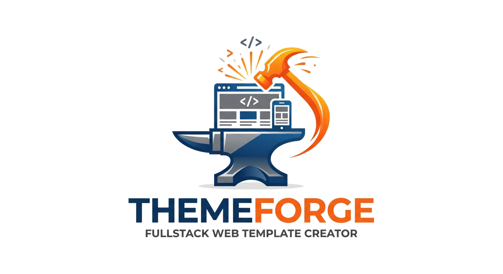

<p align="center">
    
</p>

<p align="center">
  <strong>Forge production-ready web templates with AI agents.</strong>
</p>

<p align="center">
  <a href="https://github.com/pcreativedev/themeforge/actions/workflows/build-linux.yml"></a>
  <a href="https://github.com/pcreativedev/themeforge/actions/workflows/build-macos.yml"></a>
  <a href="https://github.com/pcreativedev/themeforge/releases"></a>
  <a href="LICENSE"></a>
  <a href="https://www.python.org/"></a>
</p>

<p align="center">
  <a href="docs/USER_GUIDE.md">User guide</a> ·
  <a href="ROADMAP.md">Roadmap</a> ·
  <a href="CHANGELOG.md">Changelog</a> ·
  <a href="../../releases">Releases</a> ·
  <a href="CONTRIBUTING.md">Contributing</a> ·
  <a href="NOTICE.md">Third-party</a>
</p>

---

**ThemeForge** is a PyQt6 desktop GUI that scaffolds modern template
projects for **ThemeForest / CodeCanyon / Creative Market / Gumroad**
and drives them end-to-end with **AI coding agents** (Claude Code,
Codex, Gemini, OpenCode).

Pick a stack, pick a mode (from scratch / recreate-from-reference /
adopt-local / existing-repo), pick an AI provider, and ThemeForge:

- 🏗️ **Runs the official scaffold** of the stack (Next.js / Astro /
  Laravel / WordPress / Flutter / Tauri / + ~55 more).
- 🧠 **Drops a `CLAUDE.md`** (or `AGENTS.md`) with project context,
  market research, requirements and anti-copy rules.
- 💬 **Analyses a reference template interactively** with the AI
  (multi-turn dialog) and injects the conversation into the project.
- 🖼️ **Opens a per-project window** with embedded multi-tab preview,
  embedded terminal (xterm.js + node-pty), one-click GitHub push,
  and optional pixel-art session visualizer.
- 💰 **Tracks AI cost** with QtCharts donut / bar / stacked charts
  pulling from your local Claude Code + Codex session stores.
- 🤝 **Compares agents side-by-side** — same prompt, multiple models
  in parallel.
- 🚀 **Deploys demos** to Netlify / Vercel / Cloudflare Pages / Surge
  with one click.
- 🔐 **Wires your own licensing system** into every generated theme
  (Lemon Squeezy / Polar / Paddle / custom endpoint).

📖 **[Read the full user guide → `docs/USER_GUIDE.md`](docs/USER_GUIDE.md)**

## Download

Pre-built packages for each tagged release are published on the
[Releases page](../../releases). Pick the one matching your OS:

| Format | Platform | Install |
|---|---|---|
| `ThemeForge-<ver>-x86_64.AppImage` | 🐧 Any Linux x86_64 | `chmod +x *.AppImage && ./ThemeForge-*.AppImage` |
| `themeforge_<ver>_amd64.deb` | 🐧 Debian / Ubuntu | `sudo apt install ./themeforge_*.deb` |
| `themeforge-<ver>-1.x86_64.rpm` | 🐧 Fedora / RHEL / openSUSE | `sudo dnf install ./themeforge-*.rpm` |
| AUR `themeforge` / `themeforge-git` | 🐧 Arch / CachyOS / Manjaro | `paru -S themeforge` (after AUR publish) |
| `ThemeForge-macOS.zip` (alpha) | 🍎 macOS 13+ x86_64 | Unzip, drag to `/Applications/`, right-click → Open |
| `Source code (tar.gz / zip)` | 🐧🍎🪟 Any | Auto-generated by GitHub for every release |

Linux packages are built on `ubuntu-22.04` (glibc 2.35) so the
AppImage runs on most distros from 2022 onwards.

## Platform support

| Platform | Status | Notes |
|---|---|---|
| 🐧 **Linux** | ✅ **Beta / supported** | Primary development platform. Tested on CachyOS / Arch / Ubuntu / Fedora. Run from source with `python3 themeforge.py`. |
| 🍎 **macOS** | ⚠️ **Alpha** | Cross-platform refactor complete (subprocess, file manager, terminal, paths all dispatched per OS). Pre-built `.app` available from the [Releases](../../releases) page (built via GitHub Actions on `macos-latest`). **Not yet tested on real Macs** — expect rough edges; report issues. App is **not code-signed** — first launch will require `Cmd+click → Open` to bypass Gatekeeper. |
| 🪟 **Windows** | 🔴 **Backlog** | Tracked in [`ROADMAP.md`](ROADMAP.md#cross-platform-support). Estimated 3-5 days of additional refactor (PowerShell wrapper, path conventions, no-bash). PRs welcome. |

## Quick install

### Linux (from source)

```bash
git clone https://github.com/pcreativedev/themeforge.git
cd themeforge

# System deps (Arch / CachyOS)
sudo pacman -S --needed python python-pyqt6 python-pyqt6-webengine python-pyqt6-charts nodejs npm git

# Embedded terminal server
cd terminal && npm install && cd ..

# Launch
./launch.sh
```

For Debian / Ubuntu instructions, AI provider setup, and full
configuration, see the [user guide](docs/USER_GUIDE.md#3-installation).

### macOS (pre-built .app — alpha)

1. Download `ThemeForge-macOS.zip` from the [Releases](../../releases) page.
2. Unzip → drag `ThemeForge.app` to `/Applications/`.
3. First launch: **right-click** → **Open** → confirm the "developer not
   identified" dialog. Subsequent launches will work normally.
4. Install Node + the AI CLIs separately (the .app doesn't bundle them):
   ```bash
   brew install node gh
   npm i -g @anthropic-ai/claude-code @openai/codex @google/gemini-cli opencode-ai
   ```

### macOS (from source)

```bash
git clone https://github.com/pcreativedev/themeforge.git
cd themeforge
brew install python@3.12 node gh
pip3 install pyqt6 pyqt6-webengine pyqt6-charts
cd terminal && npm install && cd ..
python3 themeforge.py
```

## Highlights

- **60+ stacks** — Next.js, Astro, Laravel, WordPress (block themes
  and plugins with MCP-adapter), Shopify Liquid, Flutter, Expo, Ionic,
  Tauri, Electron, Spring Boot, Ktor, Phaser, R3F, and more.
- **Multi-stack mono-repo detection** — automatic sub-project
  dropdown for projects like `Files/Laravel/` + `Files/Flutter/`.
- **Conversational reference analysis** — multi-turn IA dialog with
  TTFT/token/cost metrics, saved into the project's CLAUDE.md.
- **Embedded preview with tabs** — multiple URLs in the same window,
  shared URL bar, screenshot to PNG, DevTools.
- **GitHub integration** — auto-detects existing repos in your account
  and your org, offers update-or-create with idempotent `.gitignore`
  sanitisation before push.
- **🔬 Pre-flight checker** — 13 automated checks against ThemeForest
  requirements (README, LICENSE, jQuery legacy, hardcoded tracking,
  placeholders unresolved, project size, etc.) before you upload.
- **📦 Marketplace ZIP builder** — one click produces a `<slug>.zip`
  with aggressive exclusions (node_modules, .git, .env, .claude,
  MEMORY.md…) ready for ThemeForest / Gumroad / Creative Market.
- **Gallery** with card view + custom tags + project archive + last
  AI session indicator + command palette (Ctrl+K).
- **Pixel Office visualizer** (optional) — your active Claude Code
  sessions as pixel-art avatars in a virtual office.

## License

GPL v3 — see [`LICENSE`](LICENSE) (forced by the PyQt6 dependency).

## Credits

### ⭐ Special thanks to [midudev](https://github.com/midudev)

ThemeForge wires every new project to **[autoskills](https://github.com/midudev/autoskills)**
by **[Miguel Ángel Durán (midudev)](https://github.com/midudev)** —
the tool that bridges the gap between *"a fresh empty repo"* and
*"an AI agent that actually knows what it's doing"*. Autoskills
delivers curated Anthropic / Vercel / WordPress / Shopify skill
packs straight into the agent's context on day one, so the model
doesn't have to rediscover modern frontend best practices on every
project.

Without midudev's work this project would be **half the tool it is**
— scaffolding without context is just a glorified `npm create`.
**Gracias, midu.** 🙌

[`autoskills`](https://github.com/midudev/autoskills) is licensed
CC BY-NC 4.0 — we never bundle it; ThemeForge invokes it via
`npx --yes autoskills` so each user pulls the latest version straight
from midudev's repository.

### Other open-source we stand on

- [pixel-office-openclaw](https://github.com/neomatrix25/pixel-office-openclaw)
  by **neomatrix25** (MIT) — the lovable pixel-art visualizer that
  turns Claude Code sessions into avatars in a virtual office.
- [xterm.js](https://xtermjs.org/), [node-pty](https://github.com/microsoft/node-pty),
  [ws](https://github.com/websockets/ws) — the embedded terminal stack (all MIT).
- The Claude Code, Codex, Gemini and OpenCode teams for shipping
  rock-solid AI CLIs we can compose into a builder.

Full third-party attribution in
[`docs/USER_GUIDE.md` §20](docs/USER_GUIDE.md#20-credits-and-third-party-licenses)
and [`NOTICE.md`](NOTICE.md).

## Status

**Linux:** Beta — production-quality for the documented workflows.
Rough edges expected on uncommon stacks or distros far from Arch.

**macOS:** Alpha — the cross-platform refactor is in. Pre-built .app
ships from CI but hasn't been tested on real Macs yet. If you're a
Mac user willing to try it and report issues, you'd be doing the
project a huge favour. See [`ROADMAP.md`](ROADMAP.md#cross-platform-support)
for the open items.

**Windows:** Backlog. PRs welcome.

Issues and pull requests welcome.
